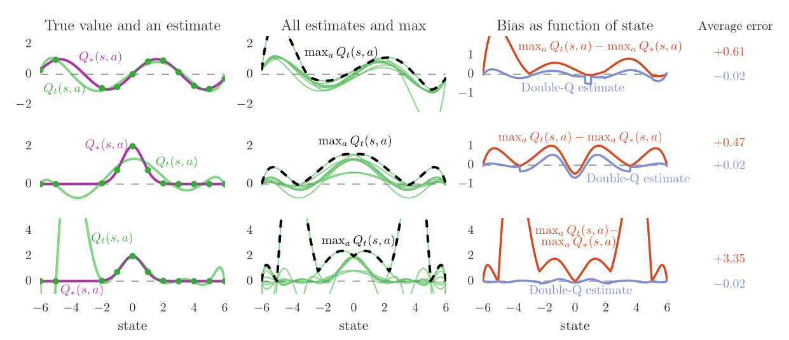

# bootstrapped DQN

MolDQN中用到了bootstrapped DQN，为了理解bootstrapped DQN的改进，从头梳理一下DQN的发展。

<!-- more -->

## Q-learning

基于价值的强化学习通过获得各个状态的价值来采取最优策略。

对于一个给定的策略$$\pi$$,在状态s采取a动作的真实价值为：

$$Q_\pi(s,a) \equiv \mathbb{E}[R_1+\gamma R_2 + ...| S_0=s,A_0=a,\pi]$$

其中$$\gamma$$是一个折扣因子，用来降低后期奖励的权重。最优值函数为：$$Q_*(s,a)=max_\pi Q_\pi (s,a)$$,最优策略就是在每个状态下选择动作值最高的动作。

为了解决无法表示全部状态动作组合的大型问题，引入了参数化的价值函数$$Q(s,a:\theta_t)$$。更新参数的过程为：$$\theta_{t+1}=\theta_t+\alpha(Y_t^{Q}-Q(S_t,A_t;\theta_t))\nabla_{\theta_t}Q(S_t,A_t;\theta_t)$$，其中$$\alpha$$是一个标量步长，$$Y_t^{Q}$$定义为：$$Y_t^{Q}\equiv R_{t+1}+\gamma \max \limits_{a}Q(S_{t+1},a;\theta_t)$$。

通过随机梯度下降方法,向目标值$$Y_t^{Q}$$方向更新当前值函数$$Q(S_t,A_t;\theta_t)$$。

## DQN

深度Q网络用一个多层神经网络作为价值函数，它将状态s作为输入，输出一个动作值向量$$Q(s,·;\theta)$$，其中$$\theta$$是网络的参数。

DQN主要用了两个技巧：目标网络与经验重放

* $$Y_t^{DQN}\equiv R_{t+1}+\gamma \max \limits_{a}Q(S_{t+1},a;\theta_t^-)$$，其中$$\theta^-$$为目标网络的参数，它每$$\tau$$步更新一次与online值网络保持一致。

* 经验重放是将转移过程存储在一个buffer中，在更新网络时从buffer中取样，目的是降低连续转移过程的影响。

两个技巧都大幅度提高了算法的效率。

## 评估误差带来的过高估计

Q-learning与DQN中的max操作经常会造成过高估计，因为他们动作选择与评估动作值用的是同一个价值函数。通过一个实例来解释这个现象，其中状态是连续的实数，每个状态有10个离散的动作。并且为了简便，每个状态的最优值函数只跟据当前状态而定，所有动作的值函数都相同。

如图所示，左侧一列为同一动作的值函数，紫色曲线为真实的值函数，绿色曲线为从真实值函数采样拟合得到的估计值函数。真实值函数分别为$$Q_*(s,a)=sin(s)$$（上）与$$Q_*(s,a)=2exp(-s^2)$$（中，下）。拟合函数为d维多项式，其中d=6(上，下)或d=9（下）。

从左侧一列可以看到由于无法得知全部的信息，评估值函数与真实值函数总会有差异，上面两行的评估值函数由于参数不够灵活甚至无法完全拟合采样点。但可以看到，下面的评估值函数虽然足够灵活能够经过所有采样点，但在那些未采样的状态上非常不准确。这些现象在学习过程中非常典型，因为在某一时刻总是只能得到受限的数据。

中间一列可以看到所有10个动作的评估值函数（绿色），以及优化的目标$$max_a Q_t(s,a)$$（虚线）。这些评估值函数因为采样点的不同而有所差异，可以看到虚线所代表的的优化目标$$max_a Q_t(s,a)$$总比真实最优值$$Q_*(s,a)$$要大。

右侧一列显示了这种差距，橘色曲线表明了这种估计得到的偏移量的升高部分。紫色曲线为double q-learning得到的估计，可以看到它是无偏的。

## double q_learning

为了解决过高估计的问题，使用两个值函数，他们的weight分别为$$\theta$$与$$\theta'$$。每一次更新，由其中的一个决定策略，另一个决定动作值。

$$Y_t^{DoubleQ}\equiv R_{t+1}+\gamma Q(S_{t+1},\mathop{\arg\max}\limits_{a}Q(S_{t+1},a;\theta_t) ;\theta_t')$$

其中$$\theta_t$$作为online策略进行动作选择，而$$\theta_t'$$进行值评估。$$\theta_t'$$可以与$$\theta$$进行交换来更新$$\theta_t'$$。

## double DQN

把dqn中的$$\theta_t^-$$作为进行评估的函数

$$Y_t^{DoubleDQN}\equiv R_{t+1}+\gamma Q(S_{t+1},\mathop{\arg\max}\limits_{a}Q(S_{t+1},a;\theta_t) ;\theta_t^-)$$

DQN中$$\theta_t^-$$的更新过程并没有改变

在获得double q_learning的大部分好处的同时，来最小化对DQN的改变。

the diversity of a set of molecules is defined as the average pairwise Tanimoto distance between the Morgan fingerprints of the molecules.