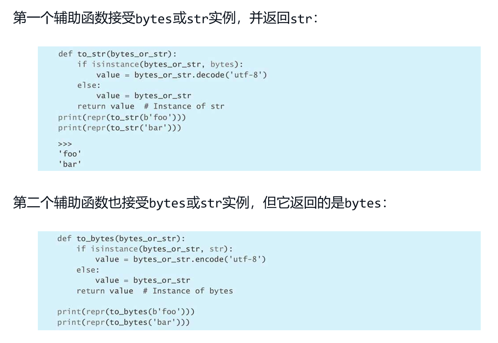
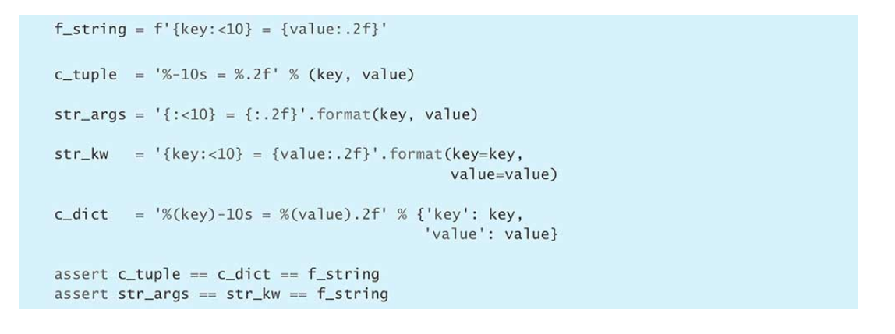
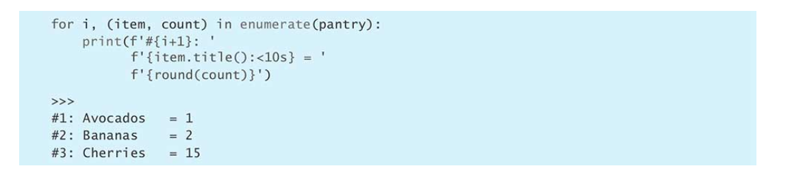
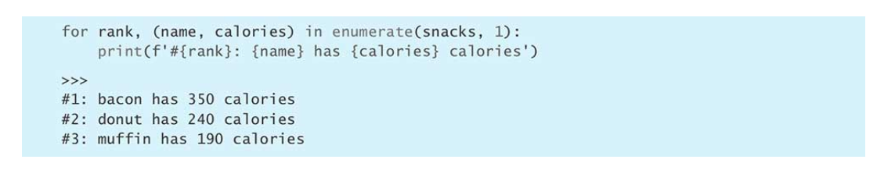
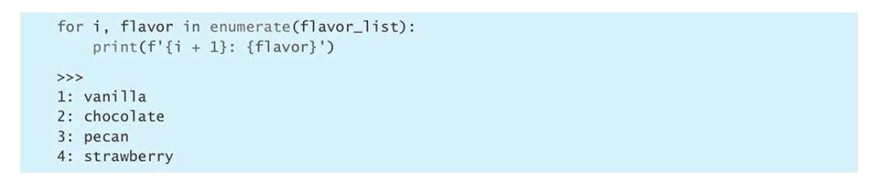
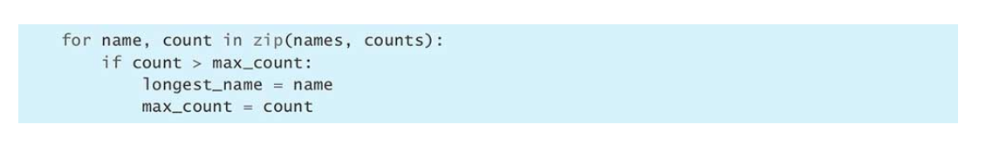
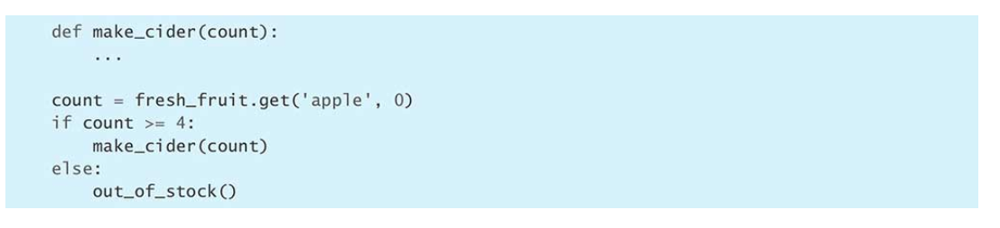
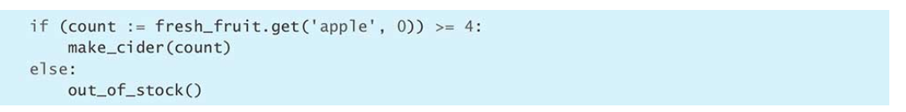

# PYTHONIC思维

## 1.PEP 8风格

### 空格相关

- 用空格表示缩进，而不用制表符（python是空白有意义的语言，要统一tab缩进空格个数）
- 语法相关缩进用4个空格
- 每行不超过79个字符
- 长表达式多余行要缩进4个空格

<!--more-->

- 函数与类之间两个空行隔开
- 同一类中方法之间一个空行隔开
- 字典冒号后加空格
- 赋值符号左右一个空格
- 注解变量名与冒号连接，类型信息前加空格

### 命名相关

- 函数变量属性：小写字母+下划线 eg：lowercase_underscore
- 受保护实例属性：下划线开头 eg：_leading_underscore
- 私有实例属性：两个下划线开头 eg：__double_leading_underscore
- 类（异常），驼峰 eg：CapitalizedWord
- 模块级别常量：全大写 eg：ALL_CAPS
- 类中实例第一个参数self
- 类方法中第一个参数命名cls

### 表达式和语句

- 行内否定 not放在值前而不是表达式前
- 直接用if判断长度为空
- if for while except用多行写
- 多行表达式用括号括起来，不用\

### 引入相关

- import放在文件开头
- 写完整 from import 
- 顺序：标准库->第三方->自定义

## 2. bytes与str

## 3 字符串格式化

使用f-string进行格式化

{}中直接可以写表达式，照其他方法都要优秀。

## 4. 辅助函数取代复杂表达式

没什么说的，嵌套表达式直接拆成辅助函数避免重复代码

## 5. 使用unpacking代替下标

原地交换原理使用unpacking

简洁清晰

## 6. 用enumerate替换下表

enumerate也可以拿到位置信息

## 7. 用zip进行多列表遍历

会在较短的列表结束时停止

## 8. 不要在for后面加else

这个特性不提都不清楚

主要是只有for全遍历后才会执行else后面的语句。

## 9. 用赋值表达式（海象操作符:=）减少重复代码

VS

