# 列表与字典

## 1. 对序列做切片

- 实现\_\_getitem\_\_与\__setitem\_\_的类都可以切割

- 形式为somelist[start: end]，左闭右开

- -1 代表最后一个元素

- 从头省略0，至尾省略len(list)
<!--more-->

- 切割时下标可以越界
- 切片后得到的是新列表
- 切片在赋值左侧时表示用右侧元素换掉范围内元素，不会判断元素个数，可能造成列表长度改变

## 2. 不要在切片中同时指定起止下标与步进

- somelist[start: end: stride],每stride个元素选取一个，可以为负数，从尾遍历，可以用于字符串反转
- 起止下标与步进尽可能分两次写。或尽量使用正数。

## 3. 通过带星号的unpack捕获多个元素，代替切片

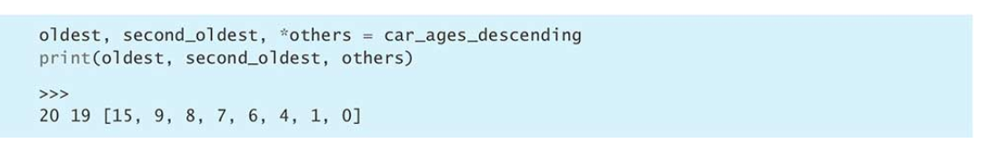

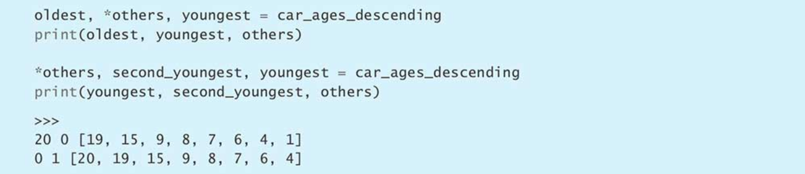

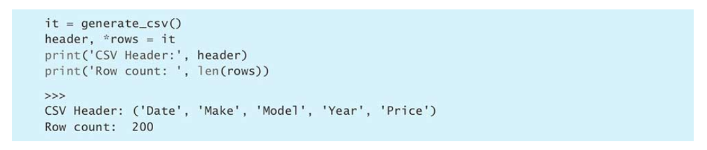

- 使用星号时至少要有一个普通的接受变量与它搭配。
- 星号变量可以在任意位置
- 在读CSV时去除表头很有用

## 4.用sort方法的key参数来表示复杂的排序逻辑
- 内置列表类型提供了sort方法，可以根据多项指标给list实例中的元素排序。

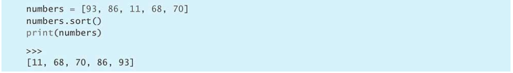

- 对于非数字的一般对象，通过lambda表达式传递给sort的key参数来实现排序。

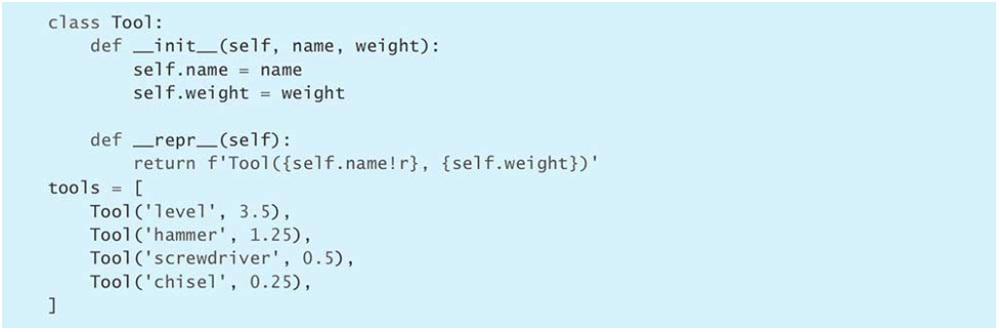

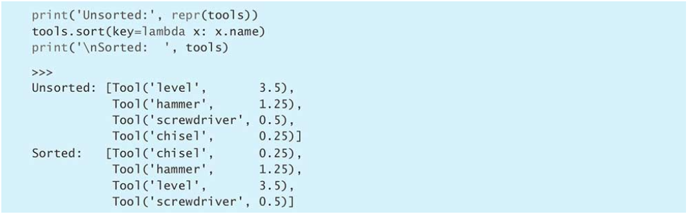

- 对于字符串类型通常要忽略大小写。可以用lower方法处理

- **对于多个字段顺序比较，优先使用元组完成**
  - 元组存在一种性质，在比较时按字段顺序比较，直到能分出结果

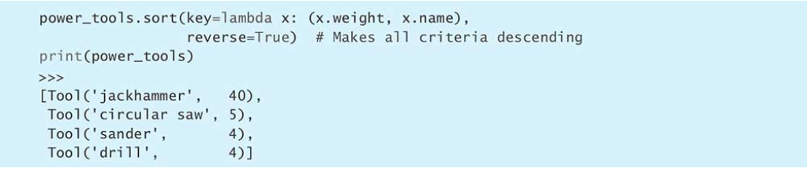

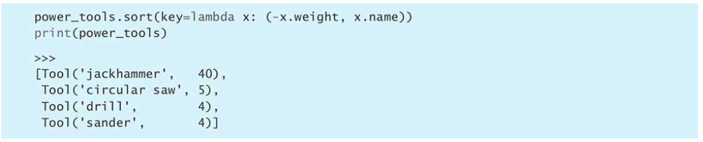

- 对于字段顺序有正序也有反序的情况，可以使用多次sort完成
  - 这是由于sort是稳定排序，即若两个值相等则排序后位置会与排序前一致
  - 将次要指标放在第一轮，将首要指标放在第二轮（反顺序进行排序）

## 5.不要过分依赖给字典添加条目时所用的顺序
- python3.6之后字典可以保证按添加顺序遍历
- 在自己实现字典时这样的假设不成立，会返回hash顺序，所以在即编写时不要利用这种顺序写代码判断。

## 6.不要用in与keyerror处理键不在字典中的情况

- 用get第二个default参数来完成。

- 值为列表的情况用in来完成

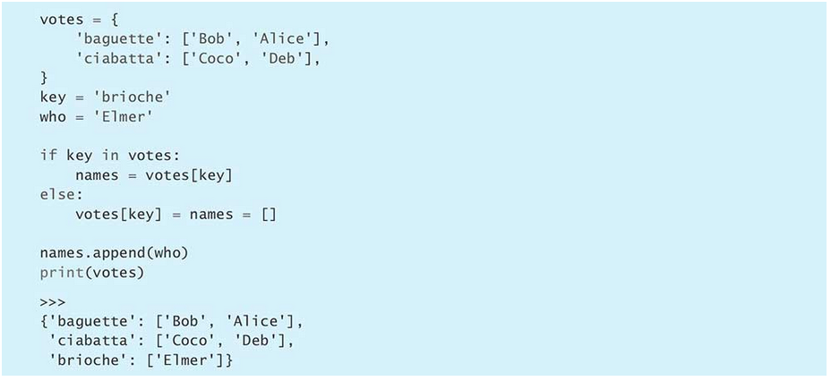

- 或用keyError和赋值表达式

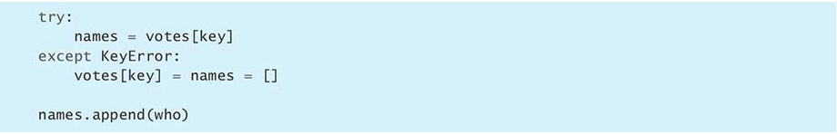

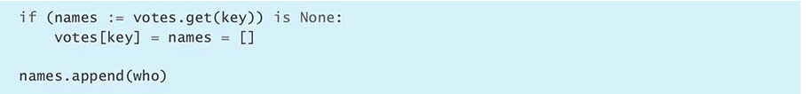

- setdefault函数

- 优先考虑用defaultdict取代dict

## 7.用defaultdict处理内部状态中缺失的元素，而不要用setdefault

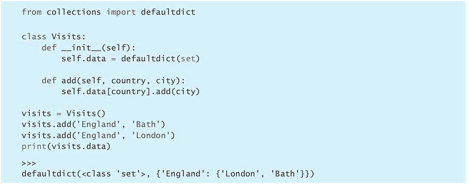

- 用下方的defaultdict不需要频繁调用add方法

## 8. 用\_\_missing__构造依赖键的默认值

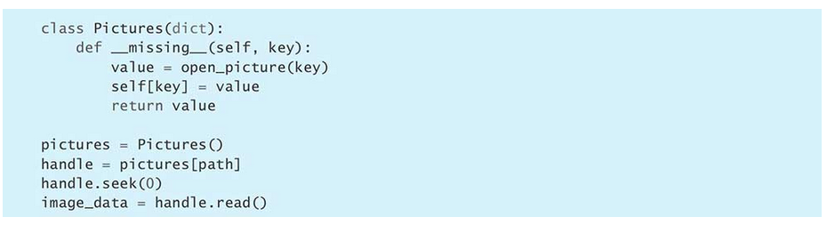

- defaultdict无法创建出需要依赖键名的默认值，而setdefault不适合会抛出异常的默认值

- 这时可以用到dict子类的_\_missing__方法，它可以通过键名构造默认值。
