# 第三章 函数

## 1. 不要把函数返回的多个值拆分到三个以上的变量中

函数返回的其实是元组

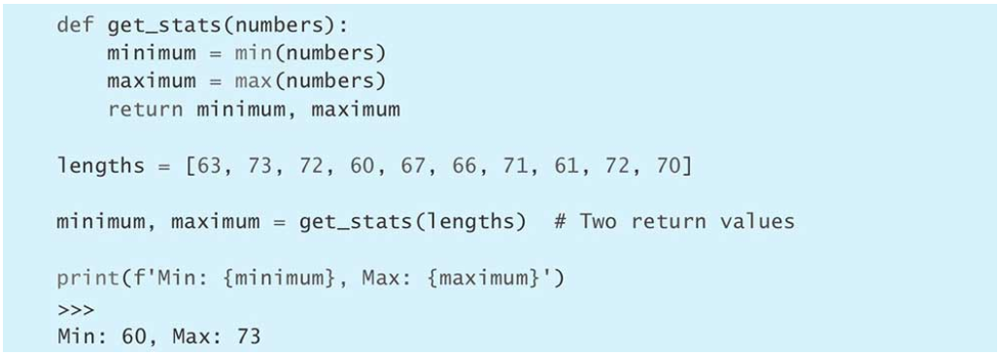

返回多个返回值会导致代码行过长，或者返回值混乱

<!--more-->

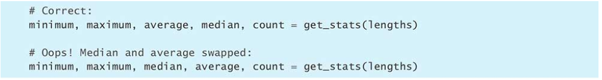

**最好定义一个轻便的类或namedtuple**

## 2. 遇到意外状况应抛出异常，不要返回None

为了防止python中判断0与None都为假的情况，在出现异常时最好raise出一个错误。

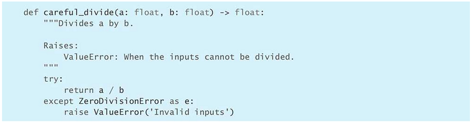

这样可以使方法调用者更清晰，不至于出错。

## 3. *了解如何在闭包中使用外围作用域中的变量

|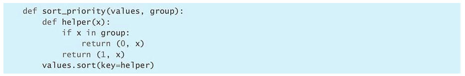|
|:--:|
|*利用闭包性质构造的函数*|

Python支持闭包（closure），这让定义在大函数里面的小函数也能引用大函数之中的变量。具体到这个例子，sort_priority函数里面的那个helper函数也能够引用前者的group参数。

函数在Python里是头等对象（first-class object），所以你可以像操作其他对象那样，直接引用它们、把它们赋给变量、将它们当成参数传给其他函数，或是在in表达式与if语句里面对它做比较，等等。闭包函数也是函数，所以，同样可以传给sort方法的key参数。

Python在判断两个序列（包括元组）的大小时，有自己的一套规则。它首先比较0号位置的那两个元素，如果相等，那就比较1号位置的那两个元素；如果还相等，那就比较2号位置的那两个元素；依此类推，直到得出结论为止。所以，我们可以利用这套规则让helper这个闭包函数返回一个元组，并把关键指标写为元组的首个元素以表示当前排序的值是否属于重要群组（0表示属于，1表示不属于）。？


|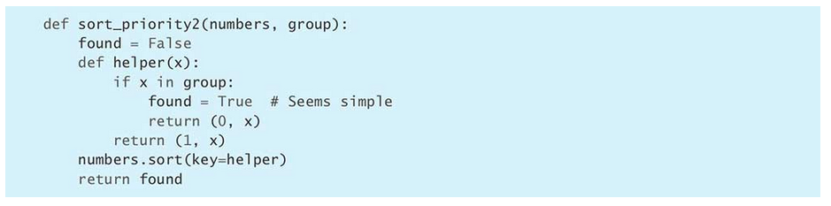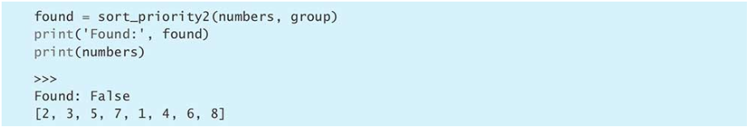|
|:--:|
|*函数返回值的found变量应该在内部函数中改为了True，为什么看到的是false*|

**注意**

在表达式中引用某个变量时，Python解释器会按照下面的顺序，在各个作用域(scope)里面查找这个变量，以解析(resolve)这次引用。

1. 当前函数的作用域。

2. 外围作用域（包含当前函数的其他函数所对应的作用域）。

3. 包含当前代码的那个模块所对应的作用域（也叫全局作用域，global scope）。

4. 内置作用域（built-in scope， 也就是包含len域str等函数的那个作用域）

   如果都没有相符的变量就抛出NameError异常

全局作用域：python代码主体中创建的变量是全局变量，属于全局范围

```python
x = 300

def myfunc():
	print(x)
myfunc()

print(x)
```

x即在全局作用域中

内置作用域：python程序启动后由python虚拟机自动加载，在程序的任何地方都可以使用，例如print函数，随着解释器存在或消亡。

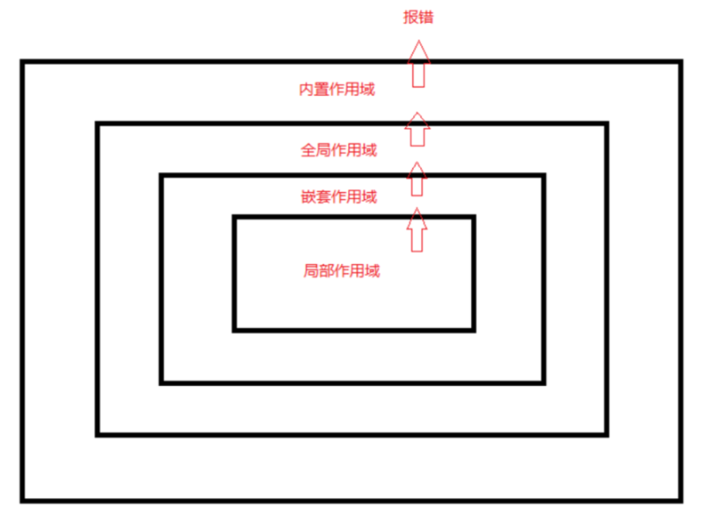

在对变量赋值时，分为两种情况处理

- 如果变量已经定义在当前作用域中，那么直接把新值交给它即可。
- 如果当前作用域中不存在同名变量，即使外围作用域中有同名变量，Python也会把这次赋值当作变量定义来处理，也即当前赋值操作的函数为新定义的这个变量的作用域。

因此上面出现错误的原因即，为True的found只是在内部函数helper作用域中的变量，而返回时返回的是在外部函数sort_priority2中未进行第二次赋值的为False的found。

这种问题也称作作用域bug（scoping bug）

用nonlocal声明变量可以在内部作用域中使用外部定义的变量

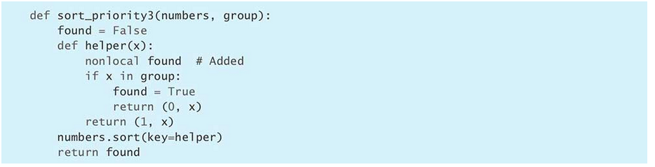

与之相对global可以在内部作用域定义全局作用域的对象。

但这种定义会引起混乱所以要慎用，尽量在简单的函数中才使用，让nonlocal与global声明与变量的使用尽可能近。

也可以改用辅助类来封装状态。

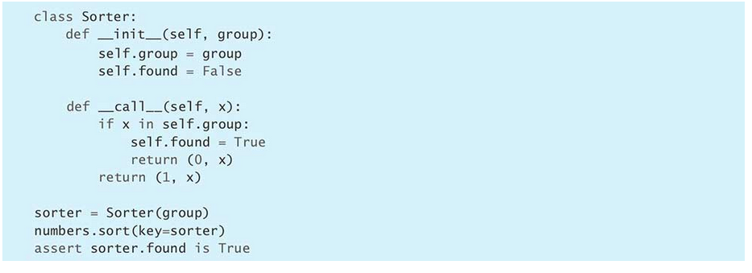

## 4. 用数量可变的位置参数给函数设计清晰的参数列表

用def定义函数时，可以通过*args的写法让函数接受数量可变的位置参数。

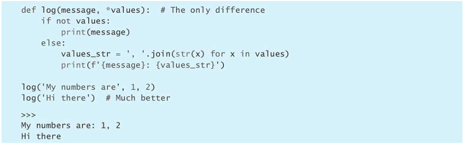

调用函数时，可以在序列左边加上*操作符，把其中的元素当成位置参数传给\*args所表示的这一部分。

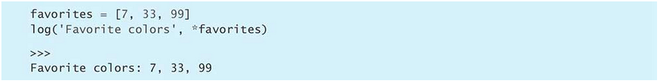

不要把*操作符加载生成器前，因为可能导致耗尽内存。

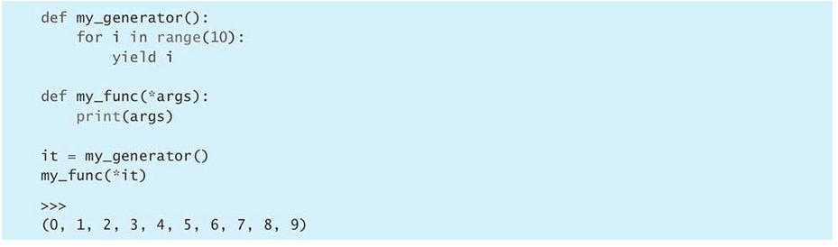

给接受*args的函数添加新位置参数，可能导致难以排查的bug。

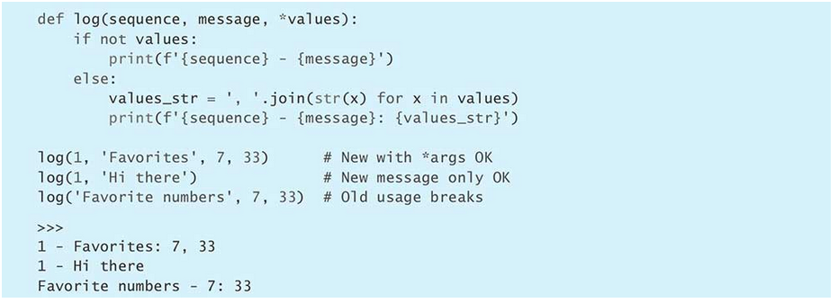


## 5. 用关键字参数来表示可选的行为

python中位置参数必须出现在关键字参数之前，否则就会出错。

每个参数只能指定一次，不能既通过位置形式指定，又通过关键字形式指定。

**如果有一份字典，而且字典里面的内容能够用来调用remainder这样的函数，那么可以把\*\*运算符加在字典前面，这会让python把字典里面的键值以关键字参数的形式传给函数。**

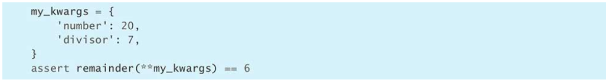

**如果多个字典提供的参数不重叠，也可以对多个字典分别施加\*\*操作**

定义函数时如果想让函数接受任意数量的关键字参数，可以在参数列表里写上万能形参**kwargs，它会把调用者传进来的参数集合到一个字典里面稍后处理

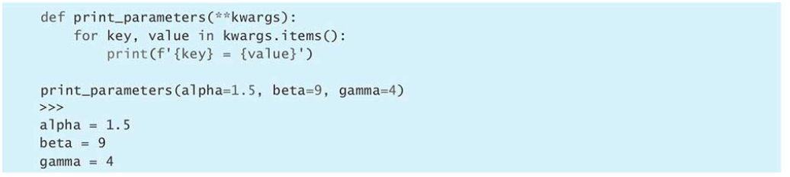

设置默认值，可选行为，降低出错概率

## 6. 用None和docstring来描述默认值会变得参数

| 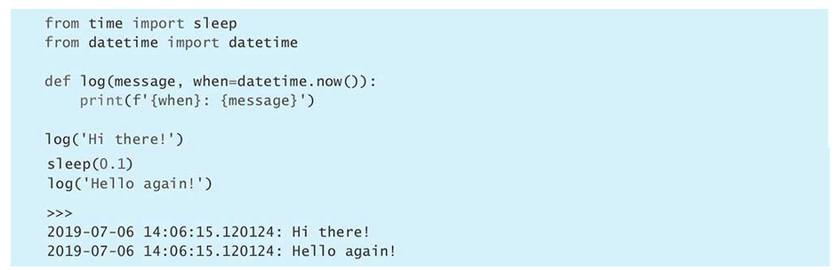 |
| :----------------------------------------------------------: |
| *如果这样写，when不会在每次调用时重新获取当前时间，而是会在系统加载模块时固定下来，因此要通过默认值为None得方式进行动态默认参数得赋值。* |

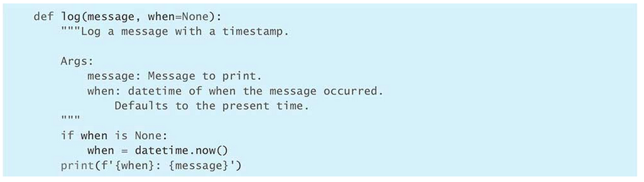

在docstring中要写清当参数为None时应该进行什么样的操作。

设为None也可以给调用者能够控制默认结果的能力。

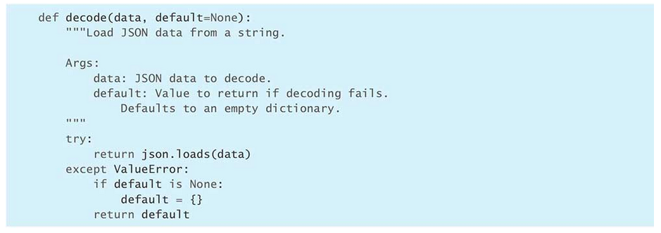

注意：**不能像下图一样，直接将参数设为空，default会在模块加载时初始化，此后每次返回默认值都会返回同一个dict，导致出现问题**

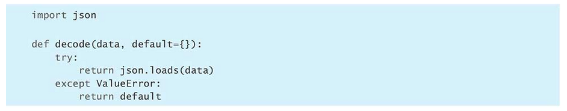

可以与类型注解搭配

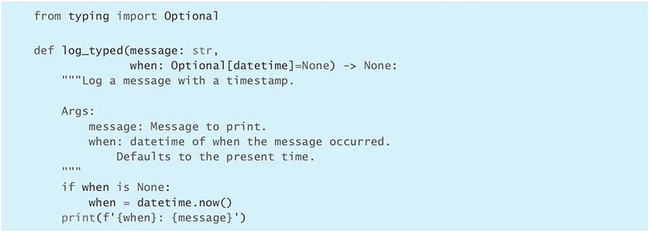

## 7. 通过指定参数只能用关键字传入来整理传入参数

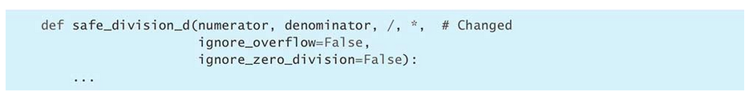

*之后的参数只能通过关键字传入，在函数有多个同类型易混淆等复杂情况时，通过要求调用者用关键字传入的方式防止出错。3.8之后，可以强制/左侧的参数只能用位置传入，使得参数名称与函数解耦。

## 8. 用functools.wraps定义函数修饰器

修饰器存在的意义：由修饰器访问并修改调用者传给函数的**参数值**，函数**返回给调用者的值**，以及函数抛出的**异常**。

这个机制能够确保用户以正确的方式使用函数（鲁棒性），也能用来调试程序或实现函数注册功能，此外还有很多用途。

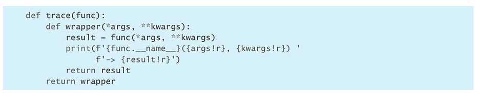

*args与**kwargs分别代表位置参数与关键字参数。

写好后用@符号将修饰器运用在想修饰的函数上。

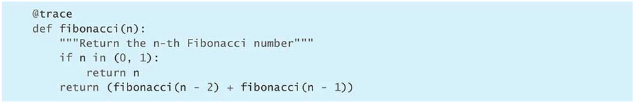

但这样会导致fibonacci函数的函数名为trace内部的wrapper，会导致反射机制等利用函数名的机制出问题，因此，可以改用functools中的wraps辅助函数来实现。

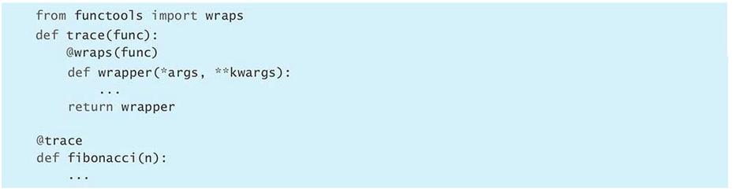

wraps本身也是修饰器，它会将元数据从内部函数复制到外部函数中，func->wrapper

wraps可以保留函数的标准属性（例如_\_name\_\_、\_\_module\_\_、__annotations\_\_）等。

