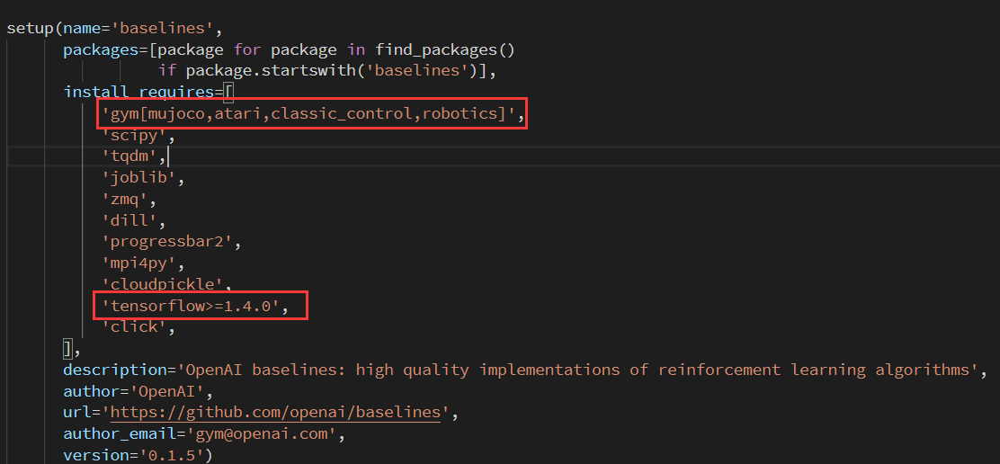
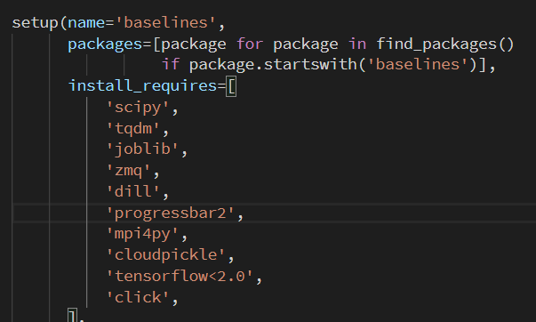

《Graph Convolutional Policy Network for Goal-Directed Molecular Graph Generation》

这篇论文在github中给出了源码：

https://github.com/bowenliu16/rl_graph_generation

但在环境配置时出现了问题，原因是其中gym的mujoco模块没能成功安装。

<!-- more -->

可以看到在gym中要求安装mujoco模块，而在实际的代码设计中没有用到mujoco的东西，

而下面的tensorflow要求为>=1.4.0 然而目前TensorFlow已经更新了2.0版本，其中有大部分函数的修改，直接运行很有可能安装到最新版本。

将gym行删掉，改为自己用命令行conda install gym 安装gym

下面的tensorflow改成<2.0 它会安装最近的符合这个标准的tf

其他的按照网站中的搭建步骤搭建即可。

