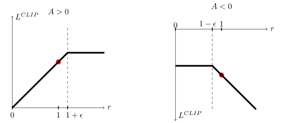
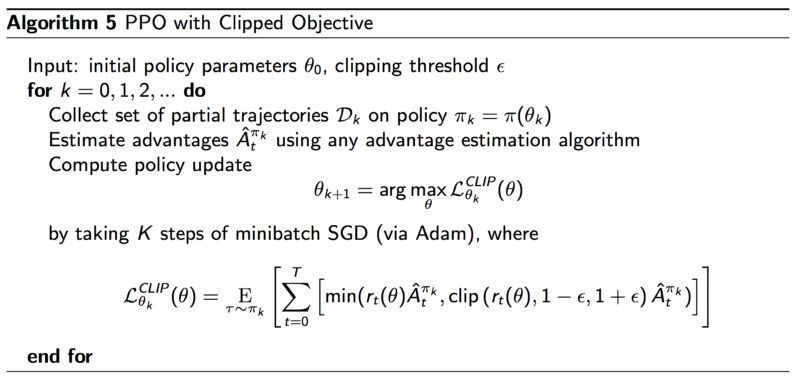

# PPO

TRPO的最终替代函数为：

$$L^{CPI}(\theta)=\mathbb{E}_t\bigg[ \frac{\tilde\pi_\theta(a_t|s_t)}{\pi_{\theta_{old}}(a_t|s_t) }A_t\bigg]$$

因为用到了重要性采样，保留了之前策略的动作与状态分布，CPI（Conservation Policy Iteration）保留策略迭代。

记概率比值$r_t(\theta) = \frac{\tilde\pi_\theta(a_t|s_t)}{\pi_{\theta_{old}}(a_t|s_t) }$，得到$L^{CPI}(\theta)=\mathbb{E}_t\big[ r_t(\theta)A_t\big]$

**问题**

没有约束条件的话，最大化$L^{CPI}$会导致大幅度的策略更新，因此要想办法通过改变目标函数，来对那些$r_t(\theta)$项离1很远的情况进行惩罚。

<!-- more -->

**解决**

PPO提出了一种替代函数的替代

$L^{CLIP}(\theta)=\mathbb{E}_t\big[\min(r_t(\theta)A_t,clip(r_t(\theta),1-\epsilon,1+\epsilon)A_t)\big]$

通过其中的clip裁剪，来去掉最大化TRPO替代函数时大幅度改变$r_t(\theta)$的倾向。也就是说只保留那些使目标更好的比值变化，舍弃那些使目标变坏但靠着比值增大硬拉替代函数值的比值变化。

通过取小值来保证它是裁剪前函数的下界，来达到最大化下界的目的。

上图是在特定t下的裁剪情况，其中左图代表正奖励时的裁剪，右图代表负奖励时的裁剪

还有一种自适应改变步长的替代方法，首先它采用的是带KL散度惩罚的替代函数

$L^{KLPEN}(\theta) = \mathbb{E}\bigg[\frac{\pi_\theta(a_t|s_t)}{\pi_{\theta_{old}}(a_t|s_t)}A_t-\beta KL[\pi_{\theta_{old}}(\cdot | s_t),\pi_{\theta}(\cdot | s_t)]\bigg]$

在每次小集群的随机梯度下降中，计算一个$d = \mathbb{E}_t[KL[\pi_{\theta_{old}}(\cdot | s_t),\pi_{\theta}(\cdot | s_t)]]$

- 如果$d< d_{targ}/1.5$，那么$ \beta \leftarrow \beta/2$
- 如果$d> d_{targ} \times 1.5$，那么$ \beta \leftarrow \beta \times 2$

更新后的步长$\beta$ 用于下一次的策略更新，1.5和2是通过启发性选择得到的。初始步长也是一个超参，不过无关紧要，因为步长会被很快地调整。

这种方法并没有上一种CLIP的效果好，所以通常还是使用上面的CLIP替代。

