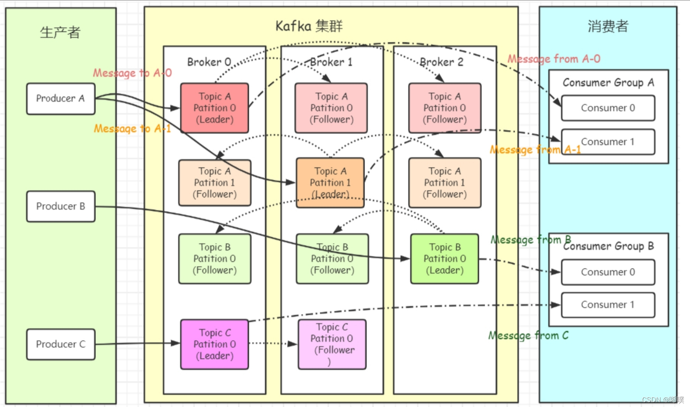
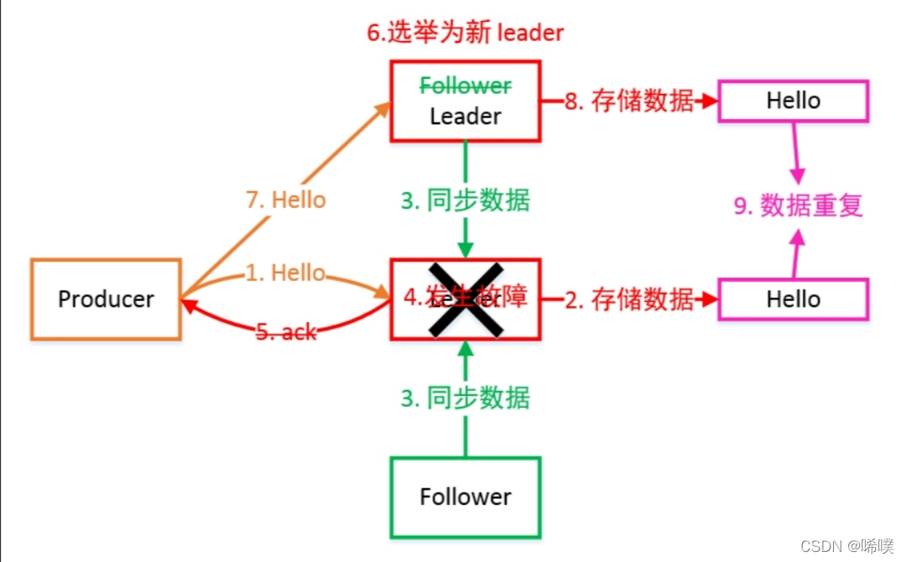
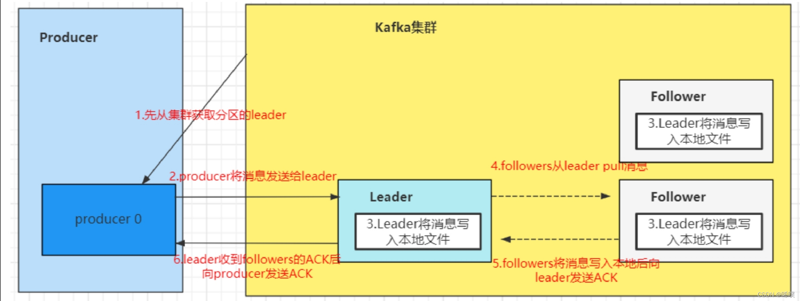

# Kafka

三个组成元素：

- 生产者
- Kafka集群
- 消费者

## 分区分配

一个Consumer Group中有多个Consumer，一个Topic有多个Partition。不同组内消费者相互独立，相同组内进行协作。一个分区只能对应一个消费者，为了尽量确保消息的有序执行，消费者数量不能超过分区数量。当组内消费者发生变化时，会触发分区分配策略。

<!--more-->

分配策略：range，按范围

​					RoundRobin，按Hash

​					Sticky，尽量保持原映射，改变

## 如何保证可靠性

### broker的可靠性

多主多从架构，需要多机房

同步双写，异步刷盘

机器断电重启：异步刷盘，消息丢失；同步刷盘消息不丢失

硬件故障：可能存在丢失

### producer发送的可靠性，producer到broker的可靠性

**ACK机制**

producer端设置request.required.acks=0；只要请求已发送出去，就算是发送完了，不关心有没有写成功。性能很好，如果是对一些日志进行分析，可以承受丢数据的情况，用这个参数，性能会很好。
request.required.acks=1；发送一条消息，当leader partition写入成功以后，才算写入成功。不过这种方式也有丢数据的可能。
request.required.acks=-1；需要ISR列表里面，所有副本都写完以后，这条消息才算写入成功。
设计一个不丢数据的方案：

数据不丢失的方案：

- 分区副本 >=2 
- acks = -1 
- min.insync.replicas >=2。

Leader维护了⼀个动态的 in-sync replica set（ISR）：和 Leader 保持同步的 Follower 集合。当 ISR 集合中的 Follower 完成数据的同步之后，Leader 就会给 Follower 发送 ACK。如果 Follower ⻓时间未向 Leader 同步数据，则该 Follower 将被踢出 ISR 集合，该时间阈值由replica.lag.time.max.ms 参数设定。Leader 发⽣故障后，就会从 ISR 中选举出新的 Leader。
kafka服务端中min.insync.replicas。 如果我们不设置的话，默认这个值是1。一个leader partition会维护一个ISR列表，这个值就是限制ISR列表里面 至少得有几个副本，比如这个值是2，那么当ISR列表里面只有一个副本的时候，往这个分区插入数据的时候会报错。

### 消费者保证可靠性

消费者也存在ack机制，只有消费者明确表示消费成功，队列才会认为消息消费成功，中途断电、抛出异常等都不会认为成功——都会进行重新投递，每次确保处理完这个消息后，再代码里调用ack，告诉消息队列消费成功。

消费端要做好幂等性处理

消费端要保留日志，即消息的元数据和消息体